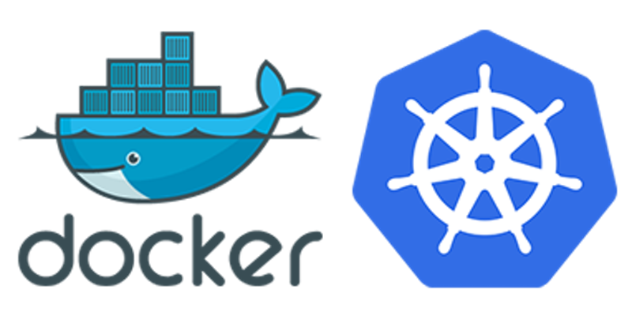

# K8s Learning

## Commands
---
### Apply file to K8s
``kubectl apply -f [yaml-file-path]``
```
kubectl apply -f k8s-namespace.yaml
```

### Get pods
```
kubectl get pods
```

### Describe pod
```
kubectl describe pods/k8s-deployment-[pod-id]
```

### Pod logs
```
kubectl logs pods/k8s-deployment-[pod-id]
```

### Show yaml file
`kubectl get [kind/name] -o yaml`
```
kubectl get ConfigMap/k8s-config -o yaml
```

### Copy created yaml file
```
k get ConfigMap/k8s-config -o yaml > k8s-copy-config.yaml
```

### Exec Pod
``kubectl exec -it my-kubernetes-dashboard [command]``

```
kubectl exec -it my-kubernetes-dashboard cat /var/run/secrets/kubernetes.io/serviceaccount/token
```

## Build
---
### Apply to yaml files.
```
kubectl apply -f k8s-namespace.yaml

kubectl apply -f k8s-namespace.yaml

kubectl apply -f k8s-configmap.yaml

kubectl apply -f k8s-secret.yaml
```

``kubectl create configmap`` -> Imperative
```
kubectl create cm k8s-imp-map --from-literal=APP_VERSION=0.0.2
```

## Docker
---
### Build
```
docker build -t k8s .
```

### Run
```
docker run k8s
```

### Tag
```
docker tag k8s:latest openfile/k8s:0.0.1
```
`openfile` name is my docker hub username. You must login to docker hub or your registry provider.

### Push
```
docker push openfile/k8s:0.0.1
```